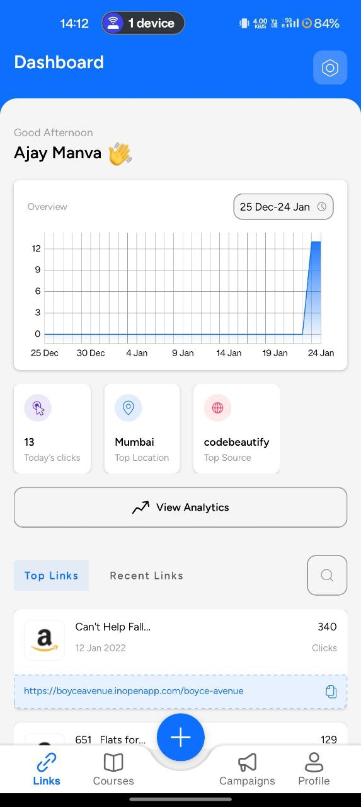
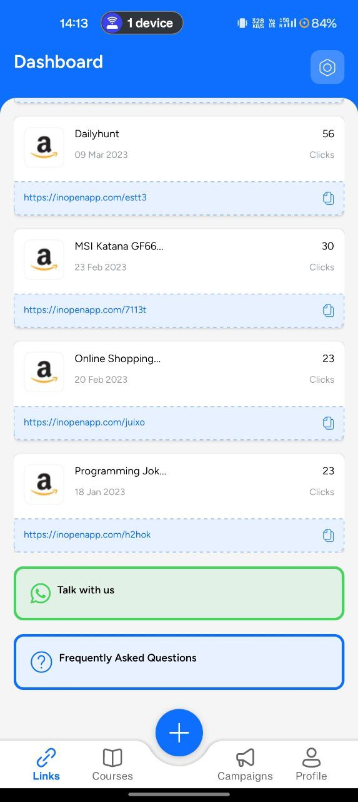
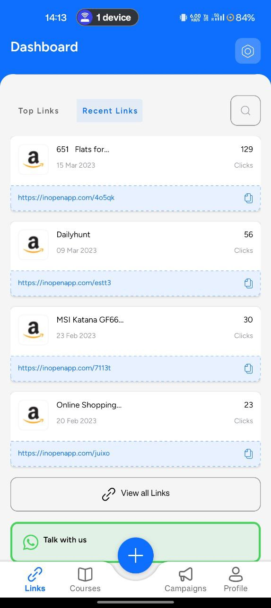

# Open in App Assignment

## Overview

This repository contains the source code for an Android app Assignment that fetches and displays data from the given API URL. The app follows the MVVM architecture, utilizes Retrofit for API calls, and integrates the Navigation Component for seamless navigation. The UI components are populated based on the response from [https://api.inopenapp.com/api/v1/dashboardNew](https://api.inopenapp.com/api/v1/dashboardNew), and the UI template can be found [here](https://iOS.openinapp.co/UITemp).

## Table of Contents
- [Features](#features)
  - [Display Greeting from Local Time](#1-display-greeting-from-local-time)
  - [Add Tab [Top Links & Recent Links]](#2-add-tab-top-links--recent-links)
- [UI Template](#ui-template)
- [API Access](#api-access)
- [Implementation Details](#implementation-details)
  - [MVVM Architecture](#mvvm-architecture)
  - [Networking Layer with Retrofit](#networking-layer-with-retrofit)
  - [Navigation Component](#navigation-component)
- [Submission Showcase](#submission-showcase)

## Features

### 1. Display Greeting from Local Time

- Fetches the local time and displays a greeting based on the time of day (e.g., Good morning, Good afternoon, Good evening).

### 2. Add Tab [Top Links & Recent Links]

- Implements tabs for Top Links and Recent Links using the Navigation Component.
- Creates a list view to display data corresponding to each tab from the API response.

## Implementation Details

### MVVM Architecture

- Implements the MVVM architecture for a clean and organized code structure.
- Utilizes view binding for seamless communication between UI components and data sources.

### Networking Layer with Retrofit

- Uses Retrofit for handling API calls.
- Implements a networking layer to handle both GET and POST API requests.

### Navigation Component

- Utilizes the Navigation Component for handling navigation between different tabs and sections.

## Submission Showcase

<table>
  <tr>
    <td></td>
    <td></td>
    <td></td>
  </tr>
</table>

#### Screen Recording

https://raw.githubusercontent.com/ayushak1/Assignment-App/main/images/screenrecording.mp4?token=GHSAT0AAAAAACMMEKQ2XBCYYDLHFXBA6IHQZNQ4LYQ

Please refer to the images and screen recording for more reference.
